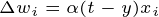

# Multy Layer Perceptron

### Berdasarkan [modul](https://drive.google.com/file/d/12OBwiae9QWiq0cYHzbycenVTy9cCRnu5/view?usp=sharing) yang berikan, berikut rumus sederhana yang telah diringkas:

**Keterangan yang ada di modul:**   
$\alpha$ = learning rate (laju pembelajaran)  atau simbol classic $\eta$   
$t$ = target keluaran (nilai yang diinginkan)  
$y$ = keluaran aktual jaringan  
$x_i$ = masukan ke-i (vektor input)  
$w_i$ = bobot ke-i (vektor bobot)  
$b$ = bias  
$\Delta w_i$ = perubahan bobot ke-i   
$\Delta b$ = delta bias   

**Update bobot:**    

$w_i(baru) = w_i(lama) + \Delta w_i$    
> **atau ditulis:**  
> $$w_i(baru) = w_i(lama) + \alpha . (t - y) . x_i$$  
>　　　　　　　　　　　└─ $\Delta w_i$    

 

<footer>
   &copy; 2025 Jaringan Saraf Tiruan &bull; @students.utdi.ac.id
</footer>
